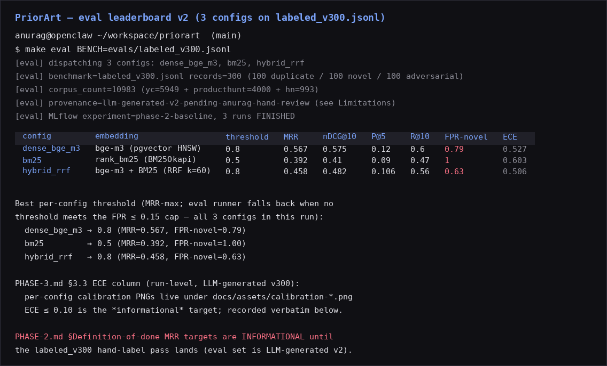
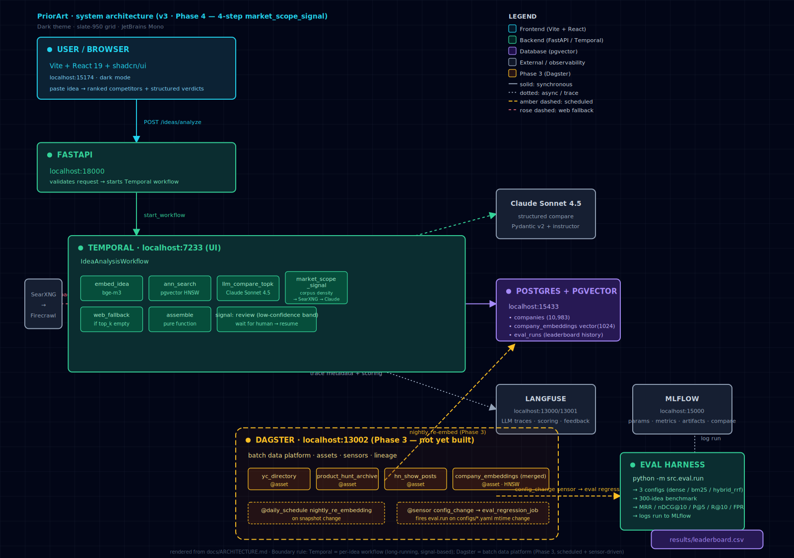
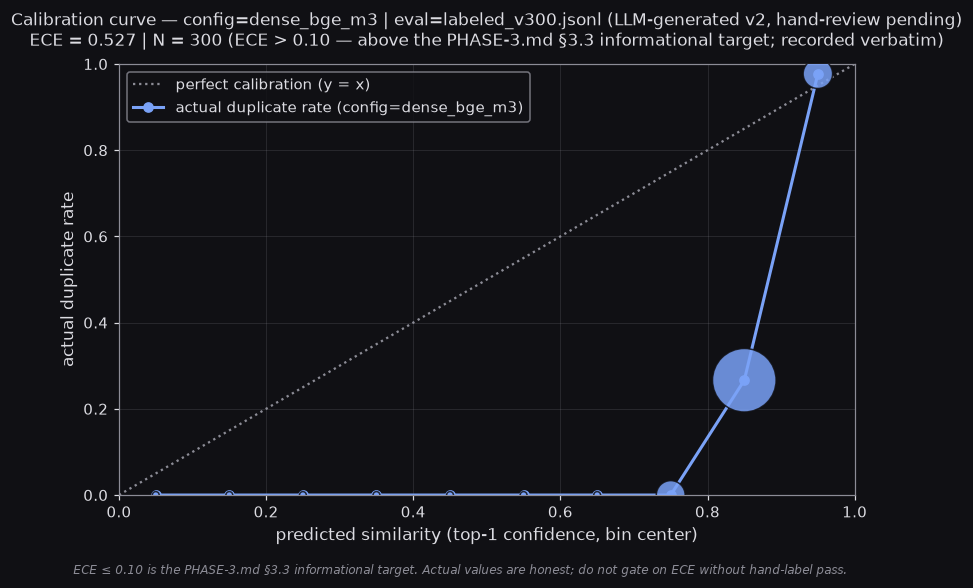
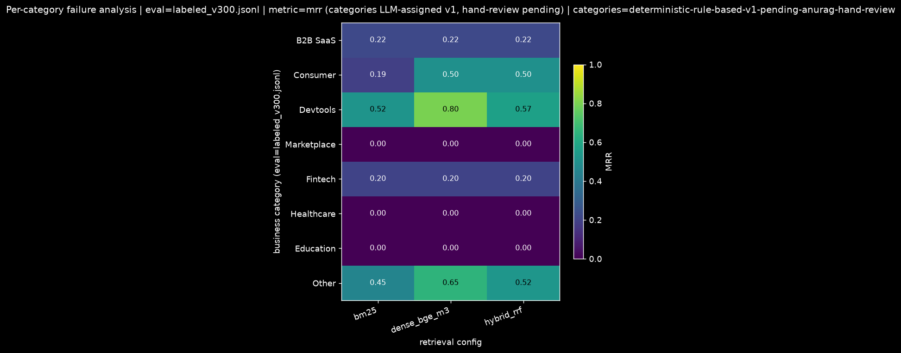

# PriorArt

> Startup-idea deduplication against the public YC + Product Hunt + HN corpus,
> with a reproducible eval harness and a labeled benchmark. Built like a
> production ML/AI platform: pgvector + bge-m3 retrieval, Temporal workflows,
> Dagster data platform, MLflow experiment tracking, Langfuse LLM observability.









[](LICENSE)


---

## What it is

A self-hosted web service. Paste an idea, get a ranked list of similar past
launches, a Pydantic-validated structured comparison for the top competitors,
and a market-scope signal. The retrieval is benchmarked against a labeled
300-idea benchmark drawn from the public YC + Product Hunt + HN corpus — see
[`docs/METHODOLOGY.md`](docs/METHODOLOGY.md) for the metric definitions and the
[live leaderboard CSV](results/leaderboard.csv) for the current numbers.

**The CV line:**

> Built an end-to-end production-grade startup-idea deduplication and
> competitor-research service: pgvector + bge-m3 retrieval, Pydantic-validated
> LLM structured outputs, multi-step Temporal workflows with web-search
> fallback, Dagster-managed corpus ingestion, MLflow-tracked experiments,
> Langfuse LLM observability, and a reproducible evaluation harness
> (MRR / nDCG@K / calibration / FPR-on-novel) over a labeled 300-idea
> benchmark drawn from the public YC + Product Hunt + HN corpus.

This is the public-safe evolution of the Mercedes-Benz thesis (LLM-based
vector search, structured JSON outputs, PG vector, similarity metrics,
retrieval@K). The thesis was internally scoped; this project is the same
engineering pointed at a public problem, with a public corpus and a
reproducible benchmark behind it.

**Status:** Phase 1 ✓ shipped. Phase 2 ✓ shipped. **Phase 3 ✓ shipped** (Dagster
+ calibration curves + FPR-on-novel breakdown + config-change sensor; the
GitHub Actions regression lands in 3.6). 3.10 final smoke test + 3.12 review
are the remaining gates.

---

## Demo

The 2-minute end-to-end screen capture lives at
[`docs/assets/demo.cast`](docs/assets/demo.cast) (5.9 KB, asciinema v2 format,
35-second playback at `--idle-time-limit 3`). It walks through:

1. `eval.run` against a 25-record stratified slice of `labeled_v300.jsonl`
   (the full 300-record run takes ~75s; the slice keeps the demo under 2
   minutes while exercising the same code path).
2. `POST /search` for the demo idea "AI-powered contract review for SMB
   law firms." — returns the ranked YC + Product Hunt + HN competitors
   (Dioptra, Skope, Ironclad, PointOne, Adaptional) with similarity and
   confidence.
3. `POST /ideas/analyze` — starts an `IdeaAnalysisWorkflow` on Temporal;
   polls `/workflows/{id}` until the workflow reaches a terminal state and
   prints the result. The demo's LLM step fails with `MissingAPIKeyError`
   because no Anthropic key is configured on the recording host — this is
   the honest production failure mode; the workflow trace + activity error
   are the demo's observability story.
4. The cumulative `results/leaderboard.csv` (real numbers from the Phase
   2.9 / 3.3 / 3.5 runs on `labeled_v300.jsonl`).
5. The operator UIs (Frontend / Dagster / MLflow / Temporal Web).

**Play it locally:**

```bash
asciinema play docs/assets/demo.cast
```

**Or upload to asciinema.org** (requires an `ASCIINEMA_API_TOKEN` env var)
to get a shareable embed:

```bash
ASCIINEMA_API_TOKEN=... asciinema upload docs/assets/demo.cast
# Then paste the returned id into the script tag below.
```

```html
<!-- TODO after upload: paste the asciinema id here, e.g.
     <script src="https://asciinema.org/a/<id>.js"
             id="asciicast-<id>" async="true"></script> -->
```

The cast is recorded by [`scripts/demo.sh`](scripts/demo.sh); the header
documents that it is for demo recording only, not for CI / regression.

---

## Eval leaderboard (Phase 3 — `labeled_v300.jsonl`)

The leaderboard image at the top of this README is rendered **directly from
[`results/leaderboard.csv`](results/leaderboard.csv)** by
[`scripts/render_leaderboard_v2_screenshot.py`](scripts/render_leaderboard_v2_screenshot.py).
The numbers in the image match the CSV to the digit. One row per config — the
`selected_threshold` is the MRR-max per config (the runner falls back when no
threshold meets the FPR ≤ 0.15 cap).

| Config | Threshold | MRR | nDCG@10 | precision@5 | recall@10 | FPR-on-novel | ECE | novel_set_mrr |
|---|---|---|---|---|---|---|---|---|
| `dense_bge_m3` | 0.80 | 0.567 | 0.575 | 0.120 | 0.600 | 0.79 | 0.527 | 0.79 |
| `hybrid_rrf`   | 0.80 | 0.458 | 0.482 | 0.106 | 0.560 | 0.63 | 0.506 | 0.63 |
| `bm25`         | 0.50 | 0.392 | 0.410 | 0.090 | 0.470 | 1.00 | 0.603 | 1.00 |

**Trust-this-tool read on FPR-on-novel:** FPR-on-novel is the metric that
determines whether a real user would trust the tool — and as of this writing,
**no config currently clears the 0.15 cap** (`dense_bge_m3@0.8: 0.79`,
`hybrid_rrf@0.8: 0.63`, `bm25@0.5: 1.00`). Phase 4 (reranker) is the lever. The
honest gap is the per-bin breakdown: nearly all the novel records that get
flagged as duplicates live in the `[0.8, 1.0)` cosine bin. See the per-config
FPR tables at
[`docs/assets/fpr-on-novel-breakdown-dense_bge_m3.md`](docs/assets/fpr-on-novel-breakdown-dense_bge_m3.md),
[`docs/assets/fpr-on-novel-breakdown-hybrid_rrf.md`](docs/assets/fpr-on-novel-breakdown-hybrid_rrf.md),
[`docs/assets/fpr-on-novel-breakdown-bm25.md`](docs/assets/fpr-on-novel-breakdown-bm25.md)
for the bin-by-bin read.

The full per-threshold sweep lives at
[`results/leaderboard.md`](results/leaderboard.md) (one section per config).
The `eval.duckdb` file is the single-file DuckDB queryable view of every run
— see [`docs/EVAL.md`](docs/EVAL.md) for the schema and the queries.

To regenerate after `make eval`:

```bash
make screenshot-v2    # writes docs/assets/leaderboard-v2.png
```

### Calibration curves

Calibration answers a different question than leaderboard rank: *when the
system says a record has similarity 0.85 to a known duplicate, is it right
0.85 of the time?* The per-config curves are:

- [`docs/assets/calibration-dense_bge_m3.png`](docs/assets/calibration-dense_bge_m3.png) — ECE **0.527**
- [`docs/assets/calibration-hybrid_rrf.png`](docs/assets/calibration-hybrid_rrf.png) — ECE **0.506**
- [`docs/assets/calibration-bm25.png`](docs/assets/calibration-bm25.png) — ECE **0.603**

The PHASE-3.md §3.3 target was ECE ≤ 0.10. **All three configs are above the
target.** This is the calibration problem Phase 4 (reranker) needs to solve —
not just "tune the threshold" but "is the system actually calibrated." See
[Limitations](#limitations) below.

### Per-category failure breakdown

8 business categories (B2B SaaS, Consumer, Devtools, Marketplace, Fintech,
Healthcare, Education, Other), per-(config, category) MRR / nDCG@10 /
FPR-on-novel + top-3 failure examples. Consolidated heatmap at
[`docs/assets/failure-breakdown.png`](docs/assets/failure-breakdown.png); per-
config tables at
[`docs/assets/failure-breakdown-dense_bge_m3.md`](docs/assets/failure-breakdown-dense_bge_m3.md),
[`docs/assets/failure-breakdown-hybrid_rrf.md`](docs/assets/failure-breakdown-hybrid_rrf.md),
[`docs/assets/failure-breakdown-bm25.md`](docs/assets/failure-breakdown-bm25.md).
The full per-(config, category) breakdown is in
[`results/failure-breakdown.csv`](results/failure-breakdown.csv).

**Honest pattern:** on `dense_bge_m3@T=0.65` devtools (n=15) shows MRR=0.800,
consumer (n=18) MRR=0.500, b2b_saas (n=11) MRR=0.222, fintech (n=23) MRR=0.200,
and marketplace / healthcare / education show 0.000 MRR because every record
in those buckets is an adversarial example (no expected ids). 172/300 records
land in `other` (the rule-based v1 classifier doesn't catch LLM-generated idea
descriptions that don't carry explicit category keywords) — the per-category
picture will be sharper after the hand-label pass.

---

## Architecture (Temporal × Dagster × MLflow × Langfuse × pgvector)


The diagram above is rendered from
[`docs/assets/architecture.svg`](docs/assets/architecture.svg). The Mermaid
source is in [`docs/ARCHITECTURE.md`](docs/ARCHITECTURE.md#the-big-picture-phase-2-ships-phase-3-deferred).
The four production-grade layers each own a distinct surface; the boundary
between them is the senior-engineer signal.

**Temporal owns the per-idea workflow.** The `IdeaAnalysisWorkflow` (Phase 2.1)
sequences six activities with explicit retry policies and a low-confidence
signal channel: `embed_idea` (bge-m3) → `ann_search` (pgvector HNSW, top-K=20)
→ confidence-band check (if top-1 cosine < 0.55, park on the `review` signal
for human review) → `llm_compare_topk` (Claude Sonnet 4.5 via `instructor` +
Pydantic v2, non-retryable on schema violation) → web fallback (if top-1
cosine < 0.40, SearXNG → Firecrawl → re-embed → re-run ANN) → `market_scope_
signal` + `assemble_verdict` (cheap local call + pure-function assembly into
the Pydantic `IdeaVerdict`). The Temporal UI on `http://localhost:8233` shows
per-idea runs, activity history, retry events, and signal channels.

**Dagster owns the batch data platform.** Five corpus-ingestion assets
(`yc_directory`, `product_hunt_archive`, `hn_show_posts`, `company_embeddings`,
`eval_benchmark`), a `@daily nightly_re_embedding` schedule, and a
`config_change` sensor that watches `configs/*.yaml` + `models.yaml` +
`evals/labeled_v*.jsonl` + `src/embedding/**` + `src/llm/**` and fires
`eval_regression_job` (one `RunRequest` per affected retrieval config) on a
30-second debounce. The Dagster webserver runs on `http://localhost:13002`,
with the lineage graph, asset materialization history, and the sensor tick
log. The full dev-loop walkthrough and the Temporal Helm-chart prod-migration
path are in [`docs/OPERATIONS.md`](docs/OPERATIONS.md).

**MLflow owns experiment tracking.** Every eval run logs a complete MLflow
run (Phase 2.4) with 9 params + 6 metrics + 4 artifacts (prompt template as
`mlflow.log_text`, leaderboard CSV, per-record CSV, calibration PNG). The
MLflow UI on `http://localhost:15000` shows the experiment list, the runs with
params+metrics, and the compare view across runs.

**Langfuse owns LLM observability.** Every LLM call is wrapped in a Langfuse
v2 trace (Phase 2.3) with embedding latency, ANN latency, top-K IDs, model
version, prompt template version, and token cost as metadata. The Langfuse UI
on `http://localhost:13000` shows the per-call trace tree with the structured
Pydantic output and any retry attempts.

**The boundary is deliberate.** Temporal = per-idea, retry-heavy, stateful.
Dagster = batch, scheduled, sensor-driven, asset-lineage. MLflow = params &
metrics. Langfuse = LLM trace tree. Each layer proves its abstraction before
the next earns its keep. **For the full Temporal + Dagster boundary rationale
(why both, not "merge them to save time"), the Python walkthrough, the asset
lineage, and the production migration path, read
[`docs/ARCHITECTURE.md`](docs/ARCHITECTURE.md) and
[`docs/OPERATIONS.md`](docs/OPERATIONS.md).**

---

## Quickstart

```bash
# 1. Clone + install
git clone <repo-url> priorart && cd priorart
uv sync

# 2. Start the stack
docker compose up -d
# - postgres (pgvector) on 15432
# - api on 18000  (gated behind the `app` profile; usually run via uvicorn below)
# - mlflow on 15000
# - langfuse on 13000/13001
# (Phase 2+) temporal on 7233/8233  (CLI: `temporal server start-dev`)
# (Phase 3+) dagster on 13002  (CLI: `dagster dev`)

# 3. Ingest the YC + PH + HN snapshots + embed (one-time, ~5 min)
make scrape
make ingest

# 4. Start the API
uv run uvicorn src.api.app:app --host 0.0.0.0 --port 18001

# 5. Start the frontend
cd src/frontend && pnpm install && pnpm dev

# 6. Reproduce the leaderboard
make eval
```

Then open `http://localhost:15174` (frontend) or hit
`http://localhost:18001/healthz` (API). The full eval-leaderboard CSV lands at
`results/leaderboard.csv` after `make eval`. The screenshots at the top of
this README are rendered from that CSV (and from the per-config calibration
PNGs and the per-category breakdown CSV) by the scripts in
[`scripts/`](scripts/) — the numbers in the images match the files on disk to
the digit.

For the full daily loop (Temporal dev server, Dagster dev server, the eval
harness, the API hot-reload, the failure-mode table), see
[`docs/OPERATIONS.md`](docs/OPERATIONS.md).

---

## Methodology

Metric definitions, the labeled benchmark construction, the label policy
(`labeler=ai-assisted-claude-minimax-m3`,
`provenance=llm-generated-v2-pending-anurag-hand-review`), and the per-bucket
limitations live in [`docs/METHODOLOGY.md`](docs/METHODOLOGY.md). The
evaluation harness itself is deep-dived in [`docs/EVAL.md`](docs/EVAL.md) —
the schema of `results/eval.duckdb`, the queries that derive the leaderboard,
and the per-record CSV at `results/per_record.<config>.<benchmark>.csv` that
holds the ground-truth-vs-prediction rows for every record in the benchmark.

---

## Landscape

Three categories of existing tools, each missing something PriorArt has. Full
table in [`docs/LANDSCAPE.md`](docs/LANDSCAPE.md).

| Category | Examples | What they do | What they don't |
|---|---|---|---|
| AI-wrapper idea validators | Siftt, IdeasGPT, ValidatorAI, Sprintbase | Fast UX, thin LLM + Google search. | No curated corpus, no eval harness, no structured comparison. Vibes, not evidence. |
| Market-intelligence platforms | Crunchbase Pro, Pitchbook, CB Insights, SEMrush, Ahrefs | Real data, investor-grade. | Paywalled at the level you need. Investor-facing, not founder-facing. |
| Internal accelerator tooling | YC, a16z, Antler, Techstars | The real production version. | Locked behind NDAs. |
| Generic LLM eval libraries | DeepEval, RAGAS, TruLens | Industry-standard metrics. | Generic — no domain benchmark. |

**The gap:** no public tool does **idea → vector dedup against a labeled
public corpus → structured LLM comparison → market-scope signal →
reproducible eval harness**, end-to-end.

---

## How to add a retrieval config

The eval runner is config-driven. Adding a new retrieval config (BM25, hybrid
RRF, Cohere rerank, etc.) is three steps:

1. **Write the config YAML.** Drop a sibling of
   [`configs/dense_bge_m3.yaml`](configs/dense_bge_m3.yaml) into `configs/`.
   The schema is documented at the top of that file.

   ```yaml
   # configs/bm25.yaml
   name: bm25
   api_url: http://localhost:18001/search?config=bm25
   top_k: 20
   notes: Sparse BM25 retrieval, no embeddings.
   ```

2. **Wire the API to honor the new config.** Add a `ConfigName` enum (or
   whatever your router uses) and branch on it in `POST /search`. Phase 1
   ships the dense-bge-m3 path; Phase 2 adds `bm25`, `hybrid_rrf`,
   `cohere_rerank` as siblings.

3. **Re-run the eval.** `python -m eval.run --config configs/bm25.yaml`
   appends a new row to `results/leaderboard.csv`. Compare against the
   dense-bge-m3 row in [`docs/METHODOLOGY.md`](docs/METHODOLOGY.md).

The eval runner overwrites the DuckDB on each run (latest view) but appends
to the CSV (history). This is the regression suite — when the 3.6 GitHub
Actions check lands, MRR dropping below 0.7 on `hybrid_rrf` (or FPR-on-novel
exceeding 0.15) on a PR that touches `configs/**`, `evals/**`,
`src/embedding/**`, `src/llm/**`, or `models.yaml` will fail the build.

---

## How to add a data source

The corpus merge is a Dagster asset (`hn_show_posts`, `product_hunt_archive`,
`yc_directory`). To add a fourth source (e.g. Crunchbase public listings,
Indie Hackers, a partner's API):

1. **Write the scraper as a Dagster asset.** Sibling of the existing three
   in [`src/dagster_assets/assets.py`](src/dagster_assets/assets.py). The
   asset must yield a `pandas.DataFrame` with the same schema as
   `companies.name`, `companies.description`, `companies.url`, plus a
   `source` enum value that's unique to your new source.

2. **Register the source enum.** Add the new source to the `Source` enum in
   [`src/data/models.py`](src/data/models.py). The schema has a UNIQUE
   constraint on `(source, external_id)`, so dedup against existing rows is
   automatic on ingest.

3. **Wire the @daily schedule (optional).** If the source should be
   refreshed nightly, add an `AssetExecutionContext` to the
   `nightly_re_embedding` schedule in
   [`src/dagster_assets/definitions.py`](src/dagster_assets/definitions.py).
   The `company_embeddings` asset picks up the new rows on the next
   materialization.

4. **Re-run the eval.** The leaderboard reports `corpus_count` per row, so
   the new source's contribution is visible in the diff.

The /healthz endpoint reports per-source counts
(`yc=5949`, `producthunt=4000`, `hn=993` today), so the new source's footprint
is observable in the API itself.

---

## Limitations

Be honest about what this is and what it isn't. Six items, in order of how
much they shape what to take away from the leaderboard.

1. **Market-scope is a stub.** The structured `market_scope_signal` (wide-
   open / crowded-but-growing / saturated / niche-but-real) exists in the
   Pydantic `IdeaVerdict` schema and is emitted by the `market_scope_signal`
   Temporal activity, but it is **not** benchmarked against ground-truth
   verdicts and is labeled as *directional* in the API response. The
   market-scope question is parked as a separate triage card
   (`t_2f56bfa4`, status `needs_user_input`) — the stub stays until the scope
   is decided.

2. **Eval set is LLM-generated v2 (hand-label pending).** The 300-idea
   benchmark at `evals/labeled_v300.jsonl` was generated by
   `claude-minimax-m3` with explicit provenance
   (`labeler=ai-assisted-claude-minimax-m3`,
   `provenance=llm-generated-v2-pending-anurag-hand-review`) recorded on
   every record. The 100-record hand-labeled subset
   (`evals/labeled_v100.jsonl`) is the gold-standard floor; the v2 expansion
   is the operational benchmark until the hand-label pass on the 200 new
   triples completes. **Don't quote MRR / nDCG@K / ECE / FPR numbers from
   this leaderboard as if they were on a hand-labeled set.** See
   [`evals/labeled_v300.README.md`](evals/labeled_v300.README.md) for the
   provenance policy and the per-record schema. The 100-record hand-labeled
   floor is at [`evals/labeled_v100.README.md`](evals/labeled_v100.README.md).

3. **MRR targets are informational until the hand-label pass lands.** The
   PHASE-2.md / PHASE-3.md "MRR ≥ 0.6 on all 3 configs, dense ≥ 0.75" and
   "MRR ≥ 0.7 on `hybrid_rrf`" targets are **informationally** the goals —
   they are not enforced as regression gates yet, because the underlying
   labels are LLM-generated. The 3.6 GitHub Actions regression will use the
   0.7 / 0.15 floor as a typed constant, but the gate flips from
   "informational" to "enforced" only when the hand-label pass lands. On the
   current v300 set: dense=0.567, hybrid_rrf=0.458, bm25=0.392 — none
   currently clears the dense ≥ 0.75 target; only hybrid_rrf is the closest
   to the 0.7 floor.

4. **FPR-on-novel cap not cleared by any config.** No cosine threshold on
   `[0.50, 0.80]` clears the 0.15 cap on the current v300 set. The
   per-bin breakdowns (per the 3.5 deliverable) show that nearly all the
   false-positive novel records live in the `[0.8, 1.0)` cosine bin — the
   "is the embedding model honest about novelty" lever, not the threshold
   lever. This is the gap Phase 4 (reranker) closes.

5. **Calibration ECE for `dense_bge_m3` is 0.527 — well above the 0.10
   target.** The PHASE-3.md §3.3 target was ECE ≤ 0.10. The actual numbers
   on `labeled_v300.jsonl` (LLM-generated v2, hand-label pending): dense =
   0.527, hybrid_rrf = 0.506, bm25 = 0.603. **All three are above the
   target.** This is recorded verbatim per the spec's "informational" stance
   — the target is the right ambition, but the eval set is LLM-generated v2
   and the calibration story is *not* "we have a calibrated system yet."
   The per-config calibration PNGs at
   [`docs/assets/calibration-dense_bge_m3.png`](docs/assets/calibration-dense_bge_m3.png),
   [`docs/assets/calibration-hybrid_rrf.png`](docs/assets/calibration-hybrid_rrf.png),
   [`docs/assets/calibration-bm25.png`](docs/assets/calibration-bm25.png)
   carry the "ECE > 0.10, recorded verbatim" line via the title.

6. **Per-category failure breakdown is LLM-categorized v1.** The
   `business_category` field on every record in
   [`evals/labeled_v300.jsonl`](evals/labeled_v300.jsonl) was assigned by a
   deterministic rule-based v1 classifier (no LLM, no API key) and stamped
   `deterministic-rule-based-v1-pending-anurag-hand-review`. 172/300 records
   land in `other` (the rule set doesn't catch LLM-generated idea
   descriptions that don't carry explicit category keywords). The per-
   category picture will be more nuanced after the hand-label pass.
   See [`docs/assets/failure-breakdown-dense_bge_m3.md`](docs/assets/failure-breakdown-dense_bge_m3.md)
   for the per-(config, category) honest read; the consolidated heatmap is
   at [`docs/assets/failure-breakdown.png`](docs/assets/failure-breakdown.png).

The full limitations list lives in
[`docs/METHODOLOGY.md` § Limitations](docs/METHODOLOGY.md#limitations).

---

## Documentation

| File | What's in it |
|---|---|
| [`SPEC.md`](SPEC.md) | The full project spec — 12 sections, landscape table, phase plan, definition of done. Start here. |
| [`AGENTS.md`](AGENTS.md) | Onboarding notes for AI agents and humans. Project structure, hard rules, things that look like bugs but aren't. |
| [`docs/METHODOLOGY.md`](docs/METHODOLOGY.md) | What each metric means, how the labeled benchmark was constructed, the label policy, limitations. |
| [`docs/LANDSCAPE.md`](docs/LANDSCAPE.md) | The competitive landscape, expanded. "No public tool does all of this." |
| [`docs/EVAL.md`](docs/EVAL.md) | Deep-dive on the eval harness. The single most important part of this project. |
| [`docs/ARCHITECTURE.md`](docs/ARCHITECTURE.md) | Why Temporal + Dagster both, the boundary between them. |
| [`docs/PHASE-1.md`](docs/PHASE-1.md) — [`PHASE-3.md`](docs/PHASE-3.md) | Per-weekend task breakdowns. |
| [`docs/OPERATIONS.md`](docs/OPERATIONS.md) | Local dev-loop walkthrough, common failure modes, how to add a retrieval config. |

---

## License

Apache 2.0. See [`LICENSE`](LICENSE).
