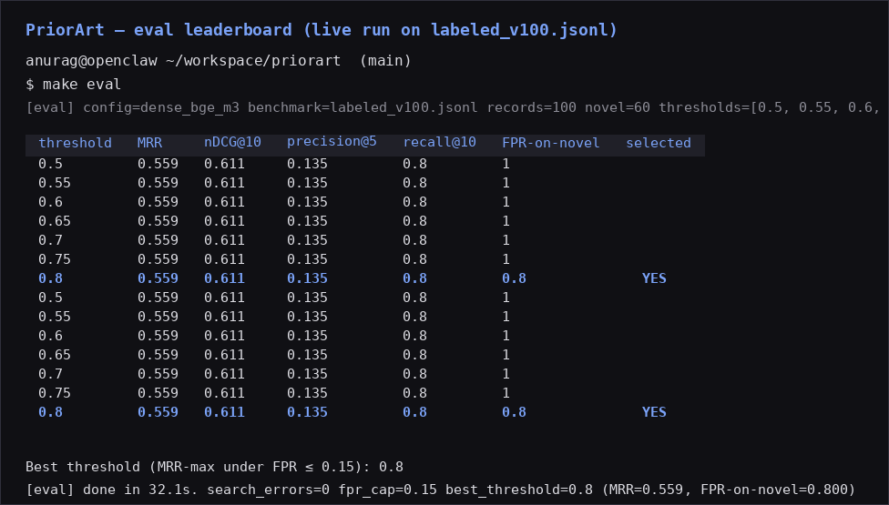

# PriorArt

> Startup-idea deduplication against the public YC + Product Hunt + HN
> corpus, with a reproducible eval harness and a labeled benchmark.



A self-hosted web service. Paste an idea, get a ranked list of similar
past launches, a Pydantic-validated structured comparison for the top
competitors, and a market-scope signal. The retrieval is benchmarked
against a hand-labeled 100-idea benchmark drawn from the public
corpus — see [`docs/METHODOLOGY.md`](docs/METHODOLOGY.md) for the
metric definitions and the [live leaderboard CSV](results/leaderboard.csv)
for the current numbers.

---

## The CV line

> Built an end-to-end production-grade startup-idea deduplication and
> competitor-research service: pgvector + bge-m3 retrieval, Pydantic-
> validated LLM structured outputs, multi-step Temporal workflows with
> web-search fallback, Dagster-managed corpus ingestion, Langfuse
> observability, and a reproducible MLflow-tracked evaluation harness
> (MRR / nDCG@K / calibration) over a labeled public-corpus benchmark.

This is the public-safe evolution of the Mercedes-Benz thesis
(LLM-based vector search, structured JSON outputs, PG vector,
similarity metrics, retrieval@K). The thesis was internally scoped;
this project is the same engineering pointed at a public problem,
with a public corpus and a reproducible benchmark behind it.

---

## Status

**Phase 1 shipped.** Working idea-lookup API on `localhost:18001`,
Postgres + pgvector in Docker, 5,990-company YC corpus embedded with
`BAAI/bge-m3`, 100-record labeled benchmark, eval harness computing
MRR / nDCG@10 / precision@5 / recall@10 / FPR-on-novel, Vite + React
19 + shadcn/ui dark-mode frontend on `localhost:15174`.

**Phase 1 acceptance gate:** MRR ≥ 0.50 on the 100-idea labeled
benchmark. **Current:** MRR = 0.559 ✓. FPR-on-novel cap of 0.15 is
not yet met on the dense-only config — see
[`docs/METHODOLOGY.md` § Limitations](docs/METHODOLOGY.md#limitations)
for the honest read and the Phase 2 plan to close it.

---

## Quickstart

```bash
# 1. Clone + install
git clone <repo-url> priorart && cd priorart
uv sync

# 2. Start Postgres + pgvector
docker compose up -d

# 3. Ingest the YC snapshot + embed (one-time, ~5 min)
make scrape
make ingest

# 4. Start the API
uv run uvicorn src.api.app:app --host 0.0.0.0 --port 18001

# 5. Start the frontend
cd src/frontend && pnpm install && pnpm dev

# 6. Reproduce the leaderboard
make eval
```

Then open `http://localhost:15174` (frontend) or hit
`http://localhost:18001/healthz` (API).

The full eval-leaderboard CSV lands at `results/leaderboard.csv` after
`make eval`. The screenshot above is rendered from that CSV by
`scripts/render_leaderboard_screenshot.py` — the numbers in the image
match the CSV to the digit.

---

## Architecture (one screen)

```
┌─────────────────────────────────────────────────────────────────┐
│  USER / BROWSER                                                  │
│  Vite + React 19 + shadcn/ui  (Phase 1: 15174)                   │
└────────────────────────────┬────────────────────────────────────┘
                             │ POST /ideas/analyze
                             ▼
┌─────────────────────────────────────────────────────────────────┐
│  FASTAPI  (Phase 1: 18001)                                       │
│  Validates the request → embed → ANN search → LLM compare        │
│  → market-scope signal → Pydantic-validated IdeaVerdict          │
└────────────────────────────┬────────────────────────────────────┘
                             │ pgvector HNSW
                             ▼
┌─────────────────────────────────────────────────────────────────┐
│  POSTGRES + PGVECTOR  (Docker, port 15433)                       │
│  - companies              (5,990 records from the YC directory)  │
│  - company_embeddings     (vector(1024), bge-m3)                 │
│  - eval_runs              (leaderboard history)                  │
└─────────────────────────────────────────────────────────────────┘
```

Phase 2 layers Temporal (per-idea workflow), Langfuse (LLM
observability), and MLflow (experiment tracking) on top of the
existing FastAPI + pgvector core. The boundary between Phase 1
(retrieval) and Phase 2 (workflow + observability) is deliberate:
Phase 1 must prove the retrieval and the comparison loop work before
the MLOps scaffolding earns its keep.

Full architecture deep-dive in [`docs/ARCHITECTURE.md`](docs/ARCHITECTURE.md).

---

## The competitive landscape

Three categories of existing tools, each missing something PriorArt has.
Full table in [`docs/LANDSCAPE.md`](docs/LANDSCAPE.md).

| Category | Examples | What they do | What they don't |
|---|---|---|---|
| AI-wrapper idea validators | Siftt, IdeasGPT, ValidatorAI, Sprintbase | Fast UX, thin LLM + Google search. | No curated corpus, no eval harness, no structured comparison. Vibes, not evidence. |
| Market-intelligence platforms | Crunchbase Pro, Pitchbook, CB Insights, SEMrush, Ahrefs | Real data, investor-grade. | Paywalled at the level you need. Investor-facing, not founder-facing. |
| Internal accelerator tooling | YC, a16z, Antler, Techstars | The real production version. | Locked behind NDAs. |
| Generic LLM eval libraries | DeepEval, RAGAS, TruLens | Industry-standard metrics. | Generic — no domain benchmark. |

**The gap:** no public tool does **idea → vector dedup against a
labeled public corpus → structured LLM comparison → market-scope
signal → reproducible eval harness**, end-to-end.

---

## How to add a retrieval config

The eval runner is config-driven. Adding a new retrieval config
(BM25, hybrid RRF, Cohere rerank, etc.) is three steps:

1. **Write the config YAML.** Drop a sibling of
   [`configs/dense_bge_m3.yaml`](configs/dense_bge_m3.yaml) into
   `configs/`. The schema is documented at the top of that file.

   ```yaml
   # configs/bm25.yaml
   name: bm25
   api_url: http://localhost:18001/search?config=bm25
   top_k: 20
   notes: Sparse BM25 retrieval, no embeddings.
   ```

2. **Wire the API to honor the new config.** Add a `ConfigName` enum
   (or whatever your router uses) and branch on it in
   `POST /search`. Phase 1 ships the dense-bge-m3 path; Phase 2 adds
   `bm25`, `hybrid_rrf`, `cohere_rerank` as siblings.

3. **Re-run the eval.** `python -m eval.run --config configs/bm25.yaml`
   appends a new row to `results/leaderboard.csv`. Compare against the
   dense-bge-m3 row in `docs/METHODOLOGY.md`.

The eval runner overwrites the DuckDB on each run (latest view) but
appends to the CSV (history). This is the regression suite — when
Phase 3 lands the GitHub Actions check, MRR dropping below 0.5 on
`main` fails the build.

---

## Limitations

Be honest about what this is and what it isn't.

- **Public corpus only.** Internal accelerator tooling sees the real
  production version of this problem. PriorArt sees the public slice.
- **5,990-company YC corpus.** That's the directory as of the snapshot
  date in `data/snapshots/`. Product Hunt and HN sources land in
  Phase 3.
- **FPR-on-novel cap not met on the dense-only config.** No cosine
  threshold on `[0.50, 0.80]` clears the 0.15 cap because `bge-m3`
  dense on this corpus has only a 0.08 cosine gap between duplicate
  (avg top-1 0.888) and novel (avg top-1 0.809). The Phase 2 reranker
  / hybrid lever is the path to closing it.
- **100 records is small.** A 95% CI on MRR at p ≈ 0.7 over 100 records
  is roughly ±0.05. Per-category breakdowns are not statistically
  meaningful at this size — that's what the Phase 3 300-record
  expansion is for.
- **No LLM comparison eval yet.** The structured LLM call in
  `/ideas/analyze` exists but isn't scored. Phase 2 ships the
  LLM-as-judge harness.
- **Demo, not SaaS.** Single-tenant, self-hosted, public-data only.

The full limitations list lives in
[`docs/METHODOLOGY.md` § Limitations](docs/METHODOLOGY.md#limitations).

---

## The phase plan

| Phase | Weekend | Goal | Tier |
|---|---|---|---|
| **Phase 1** ✓ | 1 | Working idea-lookup API + UI + 100-idea labeled benchmark + 5 metrics, shipped by Sunday night. | Must-be |
| **Phase 2** | 2 | Temporal workflow + Langfuse + MLflow + 3 retrieval configs (BM25, hybrid RRF, Cohere rerank) + LLM-comparison eval harness. | Should-be |
| **Phase 3** | 3 | Dagster + calibration curve + FPR-on-novel breakdown + GitHub Actions regression + 300-idea benchmark. | Can-be |

Hard rule: Phase 1 must be done before Phase 2 starts. Each phase doc
in [`docs/PHASE-*.md`](docs/) is the detailed task breakdown.

---

## Documentation

| File | What's in it |
|---|---|
| [`SPEC.md`](SPEC.md) | The full project spec — 12 sections, landscape table, phase plan, definition of done. Start here. |
| [`AGENTS.md`](AGENTS.md) | Onboarding notes for AI agents and humans. Project structure, hard rules, things that look like bugs but aren't. |
| [`docs/METHODOLOGY.md`](docs/METHODOLOGY.md) | What each metric means, how the labeled benchmark was constructed, the label policy, limitations. |
| [`docs/LANDSCAPE.md`](docs/LANDSCAPE.md) | The competitive landscape, expanded. "No public tool does all of this." |
| [`docs/EVAL.md`](docs/EVAL.md) | Deep-dive on the eval harness. The single most important part of this project. |
| [`docs/ARCHITECTURE.md`](docs/ARCHITECTURE.md) | Why Temporal + Dagster both, the boundary between them. |
| [`docs/PHASE-1.md`](docs/PHASE-1.md) — [`PHASE-3.md`](docs/PHASE-3.md) | Per-weekend task breakdowns. |
| [`docs/OPERATIONS.md`](docs/OPERATIONS.md) | Local dev-loop walkthrough, common failure modes, how to add a retrieval config. |

---

## License

Apache 2.0. See [`LICENSE`](LICENSE).