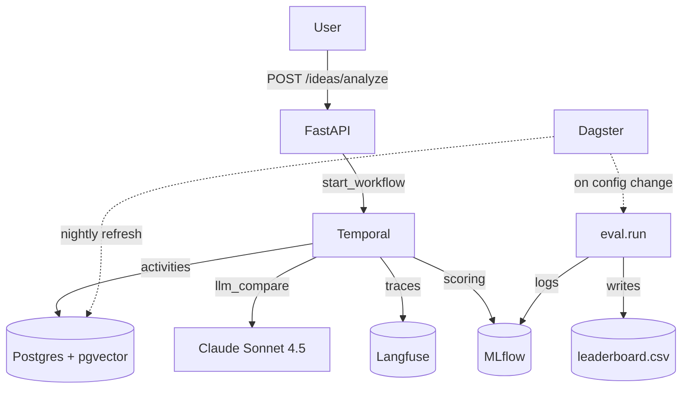

# Architecture

> Why this is built the way it's built. The architectural decisions — Temporal for the per-idea workflow, Dagster for the batch data platform, MLflow for experiments, Langfuse for LLM observability, pgvector as the actual store — are deliberate, and the boundary between them is the senior-engineer signal on the CV.


The diagram above is rendered from `docs/assets/architecture.svg` (also a hand-rendered, dark-themed SVG so the asset is reproducible from the source). The Mermaid version sits below for inline editors and PR previews. Dagster is intentionally drawn with a dashed amber boundary and marked `Phase 3 — not yet built` — see [§ Dagster (Phase 3)](#dagster-handles-the-batch-data-platform) for the boundary rationale and the deferred-work list.

---

## The big picture (Phase 2 ships, Phase 3 deferred)

```
┌─────────────────────────────────────────────────────────────────┐
│                          USER / BROWSER                          │
│  Vite + React 19 + shadcn/ui  (Phase 1: 15173)                   │
└────────────────────────────┬────────────────────────────────────┘
                             │ POST /ideas/analyze
                             ▼
┌─────────────────────────────────────────────────────────────────┐
│   FASTAPI  (Phase 1: 18000)                                      │
│   - Validates the request                                        │
│   - Starts the Temporal workflow (Phase 2+)                      │
│   - Returns the workflow ID + a polling handle                   │
│   - Or, in Phase 1 only, runs the pipeline inline                │
└────────────────────────────┬────────────────────────────────────┘
                             │ Temporal client
                             ▼
┌─────────────────────────────────────────────────────────────────┐
│   TEMPORAL  (Phase 2: 7233 for UI)  ✓ SHIPPED                    │
│   Workflow: IdeaAnalysisWorkflow                                 │
│   Activities:                                                    │
│     1. embed_idea                  ← bge-m3                     │
│     2. ann_search                  ← pgvector HNSW               │
│     3. llm_compare_topk            ← Claude Sonnet 4.5           │
│     4. market_scope_signal         ← local Qwen 2.5 32B          │
│     5. web_fallback_if_empty       ← SearXNG → Firecrawl         │
│     6. assemble_verdict            ← pure function               │
│   Signals: human_review (low-confidence verdicts)               │
└────────┬──────────────────┬──────────────────┬──────────────────┘
         │                  │                  │
         ▼                  ▼                  ▼
┌─────────────────┐ ┌─────────────────┐ ┌─────────────────┐
│   POSTGRES      │ │   LANGFUSE      │ │   MLFLOW        │
│   + PGVECTOR    │ │   (Phase 2:     │ │   (Phase 2:     │
│   (Phase 1+:    │ │   13000/13001)  │ │   15000)        │
│   15432)        │ │   ✓ SHIPPED     │ │   ✓ SHIPPED     │
│                 │ │                 │ │                 │
│   - companies   │ │   - LLM traces  │ │   - experiment  │
│   - company_    │ │   - metadata    │ │     tracking    │
│     embeddings  │ │   - scoring     │ │   - params      │
│   - eval_runs   │ │   - feedback    │ │   - metrics     │
└────────┬────────┘ └─────────────────┘ │   - artifacts   │
         │                               └─────────────────┘
         │
         │  ┌─────────────────────────────────────────────────┐
         │  │  DAGSTER  (Phase 3: 13002)  ⏳ NOT YET BUILT    │
         │  │  Batch data platform — assets, sensors, lineage │
         │  │  Assets:                                         │
         │  │    - yc_directory                                │
         │  │    - product_hunt_archive                        │
         │  │    - hn_show_posts                               │
         │  │    - company_embeddings                          │
         │  │    - eval_benchmark                              │
         │  │  Schedules: nightly_re_embedding                │
         │  │  Sensors: config_change → eval_regression_job   │
         │  └─────────────────────────────────────────────────┘
         ▼
```

The Mermaid version (for the README and PR previews):



Solid arrows = synchronous calls; dashed arrows = async/scheduled/sensor-driven.

---

## Why Temporal + Dagster, and why both

This is the architectural question that gets asked first in any system-design review, and the answer is the senior-engineer signal.

### Temporal handles the per-idea workflow

**Why Temporal:**
- The per-idea pipeline is a *long-running, retry-heavy, partially-failed* workflow. Embedding the idea takes 50ms. ANN search takes 20ms. LLM compare takes 5–15 seconds. Web fallback (if triggered) takes 10–30 seconds for the scrape + 5 seconds for the re-embed. Total p95 latency: 30 seconds. p99 with retries: 90 seconds.
- LLM calls fail transiently. Rate limits. Schema violations. Network blips. Each step needs a retry policy.
- Low-confidence verdicts need to *park* waiting for human review. That's a workflow pause + signal + resume. That's a state machine. FastAPI background tasks don't model this cleanly.
- When the system recovers from a Temporal outage, in-flight workflows resume. When it recovers from a FastAPI process crash, in-flight background tasks are lost.

**The Temporal workflow in full:**

```python
@workflow.defn
class IdeaAnalysisWorkflow:
    @workflow.run
    async def run(self, idea: str, request_id: str) -> IdeaVerdict:
        # Step 1: Embed
        embedding = await workflow.execute_activity(
            embed_idea, idea,
            start_to_close_timeout=timedelta(seconds=10),
            retry_policy=RetryPolicy(maximum_attempts=3, backoff_coefficient=2),
        )
        # Step 2: ANN search
        top_k = await workflow.execute_activity(
            ann_search, embedding, top_k=20,
            start_to_close_timeout=timedelta(seconds=5),
            retry_policy=RetryPolicy(maximum_attempts=3),
        )
        # Step 3: Check for low-confidence band
        if top_k[0].similarity < 0.55:
            # Park for human review
            await workflow.wait_condition(
                lambda: self._review_decision is not None
            )
            if self._review_decision == "confirm_novel":
                return IdeaVerdict.novel(idea)
        # Step 4: LLM compare
        verdicts = await workflow.execute_activity(
            llm_compare_topk, (idea, top_k[:3]),
            start_to_close_timeout=timedelta(seconds=60),
            retry_policy=RetryPolicy(
                maximum_attempts=3,
                non_retryable_error_types=["SchemaViolation"],
            ),
        )
        # Step 5: Web fallback if no good matches
        if top_k[0].similarity < 0.40:
            web_results = await workflow.execute_activity(
                web_fallback_if_empty, (idea, top_k),
                start_to_close_timeout=timedelta(seconds=120),
                retry_policy=RetryPolicy(maximum_attempts=2),
            )
            if web_results:
                top_k = await workflow.execute_activity(
                    ann_search, web_results,
                    start_to_close_timeout=timedelta(seconds=5),
                )
        # Step 6: Market scope + assemble
        return await workflow.execute_activity(
            assemble_verdict, (idea, verdicts, top_k),
            start_to_close_timeout=timedelta(seconds=30),
        )

    @workflow.signal
    async def review(self, decision: str) -> None:
        self._review_decision = decision
```

### Dagster handles the batch data platform

> **Status:** ⏳ Phase 3 — NOT YET BUILT. The boundary and the asset
> list below are the design; the code lands in [`docs/PHASE-3.md`](PHASE-3.md).

**Why Dagster (the boundary rationale):**
- The corpus ingestion is a *batch data pipeline*. It runs on a schedule (nightly). It materializes assets (`yc_directory`, `product_hunt_archive`, `company_embeddings`). It has lineage (a change in the YC scrape re-derives the embeddings). It has sensors (watch for config changes, fire the regression).
- Dagster's asset-centric model is the right abstraction: "the current state of `company_embeddings` is derived from `yc_directory` and `models.yaml`." That's a clearer mental model than "run this script on a cron and write to a database."
- Dagster's UI shows the lineage graph, the schedule, the sensor status, the asset materialization history. That's the "data platform" view that ML engineers and platform engineers expect.

**The Dagster assets (Phase 3 — design only, not yet implemented):**

```python
# Phase 3 work — not yet implemented. Design captured here so the
# Temporal-Dagster boundary is documented even before Dagster ships.
from dagster import asset, daily_schedule, sensor, RunRequest


@asset
def yc_directory(snapshot_date: str) -> pd.DataFrame:
    """Scrape + clean + dedup the YC public directory."""
    return scrape_yc(snapshot_date)


@asset
def product_hunt_archive(snapshot_date: str) -> pd.DataFrame:
    """Scrape the Product Hunt top 5K launches."""
    return scrape_product_hunt(snapshot_date)


@asset
def hn_show_posts(snapshot_date: str) -> pd.DataFrame:
    """Paginate the HN Algolia API for top 'Show HN' posts."""
    return scrape_hn_show(snapshot_date)


@asset
def company_embeddings(
    yc_directory: pd.DataFrame,
    product_hunt_archive: pd.DataFrame,
    hn_show_posts: pd.DataFrame,
) -> None:
    """Merge sources, embed with bge-m3, write HNSW index."""
    merged = merge_sources([yc_directory, product_hunt_archive, hn_show_posts])
    write_to_pgvector(merged, model_version="bge-m3-v0.1")


@asset
def eval_benchmark() -> Path:
    """Track the current eval-set version, surface staleness."""
    return Path("evals/labeled_v300.jsonl")


@daily_schedule
def nightly_re_embedding():
    """Re-embed on snapshot change."""
    return RunRequest()


@sensor(job=eval_regression_job)
def config_change_sensor(context, yaml_files):
    """Watch configs/ and models.yaml; fire eval regression on change."""
    new_mtime = max(f.stat().st_mtime for f in yaml_files)
    if new_mtime > context.cursor or context.cursor is None:
        yield RunRequest()
        context.update_cursor(new_mtime)
```

**Phase 3 deferred-work list (the gaps the Dagster boundary leaves open until it ships):**

- [ ] **Asset definitions** — the five assets above, with the merge logic
      pulled out of `src/data/ingest.py` into a Dagster-managed flow.
- [ ] **Nightly `re_embedding` schedule** — replace the manual
      `make ingest` with `@daily_schedule` firing on UTC midnight.
- [ ] **`config_change` sensor** — watches `configs/*.yaml` +
      `models.yaml` mtime, fires the eval regression job when either
      changes. This is the local-dev substitute for the Phase 3
      GitHub Actions regression check.
- [ ] **Lineage graph in the Dagster UI** — the visualization that
      makes the data platform story visible to operators.
- [ ] **Asset materialization backfill** — re-materialize the current
      `evals/labeled_v300.jsonl` and `company_embeddings` snapshot
      from the Dagster origin assets so the UI's "last materialization"
      timestamp is populated.

**Why Phase 3 and not Phase 2:** per `PHASE-2.md` §Pitfall, Dagster is
explicitly deferred. The corpus ingestion is currently triggered by
hand (`make scrape && make ingest`) which is fine for the weekend
build; Dagster earns its keep once there's a real schedule and a real
sensor. Adding it in Phase 2 is scope creep on top of Temporal +
Langfuse + MLflow.

### The boundary

| Concern | Owner | Why |
|---|---|---|
| Per-idea analysis workflow | Temporal | Long-running, retry-heavy, signal-based, partially-failed. |
| Corpus ingestion + nightly refresh | Dagster | Scheduled, asset-centric, sensor-driven, lineage-aware. |
| LLM observability | Langfuse | Domain-specific to LLM calls: prompt, completion, token cost, feedback. |
| Experiment tracking | MLflow | Domain-specific to ML: params, metrics, artifacts, model registry. |
| Vector storage | Postgres + pgvector | The actual data store. HNSW index for fast ANN search. |
| Eval results | DuckDB + CSV | Single file, queryable, easy to commit, versioned. |

The boundary is not arbitrary. Each tool has a defensible job, and trying to merge them (Temporal-for-everything, or Dagster-for-the-workflow) loses the abstraction that makes the system maintainable.

---

## Why pgvector (not Qdrant, not Pinecone, not Weaviate)

- **Self-hostable on a single Postgres container.** One less service to operate. HNSW index since pgvector 0.5.
- **Already in the user's stack.** Honcho uses pgvector at 1536-dim. The same Docker image, the same `pgvector/pgvector:pg16`, the same `CREATE EXTENSION vector`.
- **Good enough at 5K–50K rows.** Our corpus is YC (~5K) + Product Hunt (~5K) + HN (~5K). That's 15K rows, well within pgvector's sweet spot.
- **Honest comparison in the leaderboard.** A senior engineer would notice if we picked the vector store that made the numbers best. We picked the one that's already in the stack and is good enough. The benchmark numbers should hold up regardless of vector store.

If we ever exceed 100K rows, we revisit. For now, pgvector is the right call.

---

## Why FastAPI (not Django, not Flask, not Litestar)

- **Async-native.** The Temporal client is async. The LLM call is async. FastAPI is the only mainstream Python web framework that doesn't make this awkward.
- **Pydantic v2 first-class.** The `IdeaVerdict` and `CompetitorVerdict` schemas are the API contract. Pydantic is the validator. FastAPI uses Pydantic natively.
- **OpenAPI for free.** The `/docs` endpoint becomes the developer-facing API explorer. Useful for a portfolio project.

---

## Why Vite + React + shadcn/ui (matches the user's default stack)

- **It's the user's default frontend stack.** Per the workspace-level AGENTS.md: pnpm + Vite + TS + React + Tailwind + shadcn/ui (dark mode by default). Stay within the convention.
- **shadcn/ui gives a clean dark-mode UI without design work.** Copy the components, no design decisions to make.
- **Vite is fast.** Dev server up in 1 second. No build pipeline to debug.

---

## What this architecture does NOT include

These are explicit non-goals, listed in `SPEC.md` under "Scope discipline" and re-stated here for clarity:

- **No Kubernetes.** Docker Compose on a single host. (The user already runs Honcho + Langfuse + Firecrawl this way.)
- **No multi-tenant.** One operator, one corpus, one leaderboard.
- **No fine-tuning.** We measure, not adapt.
- **No real-time ingestion.** Corpus is a snapshot, refreshed nightly.
- **No production market-scope estimator.** Stub + honest label.
- **No auth.** Self-hosted, single-user.
- **No real-time Temporal cluster.** `temporal server start-dev` for local. Prod migration path documented in `docs/OPERATIONS.md`.

If a future contributor proposes adding any of these, push back. They're out of scope by design, and adding them would dilute the MLOps story (which is the actual point of the project).
